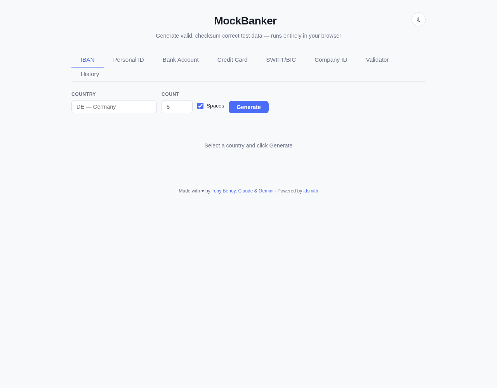

#  MockBanker

Generate and validate valid, checksum-correct **IBANs**, **Personal IDs**, **Passports**, **Driver's Licenses**, **Tax IDs**, **VAT numbers**, **LEI codes**, **Credit Cards**, and more directly in your browser. No installation, no server — everything runs client-side via WebAssembly.

**[Try it live](https://tonybenoy.github.io/mockbanker/)**

## Screenshots

<p align="center">
  
  
</p>

## Features

- **IBAN Generation & Validation** — 124 countries supported, every code passes mod-97 checksum validation.
- **Personal ID Generation** — 97 formats including PESEL, personnummer, codice fiscale, JMBG, BSN, NIR, DNI, NIF, EGN, AMKA, and more.
- **Bank Accounts & SWIFT/BIC** — Generate test account numbers and routing codes for 159 bank account formats.
- **Credit Cards** — Generate valid test card numbers (Visa, Mastercard, etc.) that pass Luhn checksum.
- **Company IDs** — Generate valid company registration numbers for supported countries.
- **Driver's Licenses** — Generate valid driver's license numbers across 79 formats.
- **Passports** — Generate valid passport numbers across 79 formats.
- **Tax IDs** — Generate valid tax identification numbers (PAN, TIN, etc.) across 80 formats with checksums.
- **VAT Numbers** — Generate valid EU VAT numbers across 28 formats.
- **LEI Codes** — Generate valid Legal Entity Identifiers per ISO 17442.
- **Validator Tab** — Validate IBANs, Personal IDs, Credit Cards, SWIFT codes, Company IDs, Driver's Licenses, Passports, Tax IDs, VAT numbers, and LEI codes directly in the app.
- **Export** — Download results as CSV, JSON, or SQL for all generator types.
- **PWA / Offline Support** — Install it on your device and use it without an internet connection.
- **Click-to-copy** — copy individual rows or all results at once.
- **Zero backend** — all logic runs in WASM, nothing leaves your browser.
- **Fast** — generates hundreds of valid codes in milliseconds.

## Contributing

Contributions are welcome! Whether it's adding a new country format, fixing a bug, or improving the UI, feel free to open an issue or submit a pull request.

1. Fork the Project
2. Create your Feature Branch (`git checkout -b feature/AmazingFeature`)
3. Commit your Changes (`git commit -m 'Add some AmazingFeature'`)
4. Push to the Branch (`git push origin feature/AmazingFeature`)
5. Open a Pull Request

## Tech Stack

- **[Leptos](https://leptos.dev/)** — reactive Rust web framework.
- **[idsmith](https://github.com/Sunyata-OU/idsmith)** — core generation & validation library (Rust).
- **[Trunk](https://trunkrs.dev/)** — WASM build tool.
- **GitHub Pages** — static hosting with automatic deploys.

## Development

```bash
# Prerequisites
rustup target add wasm32-unknown-unknown
cargo install trunk

# Dev server with hot reload
trunk serve --open

# Production build
trunk build --release
```

## License

MIT
